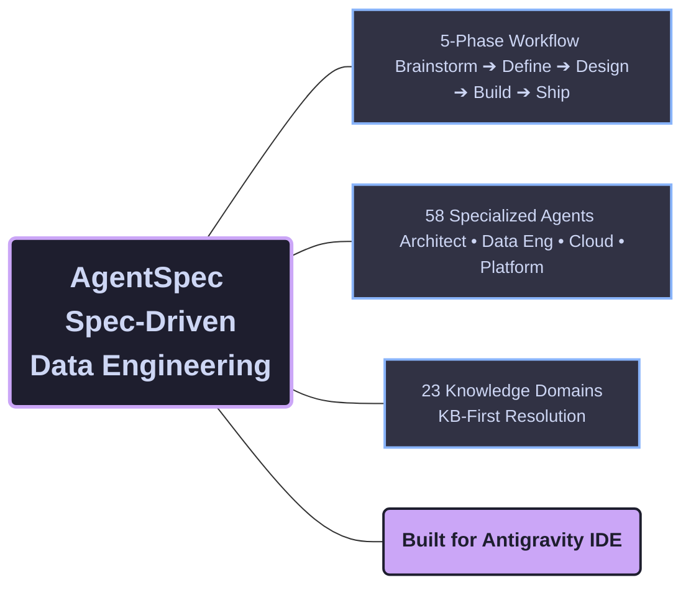

<div align="center">



<br/><br/>

[](/)
[](https://github.com/Tiao553/sdd-for-antigravity/actions/workflows/ci.yml)
[](LICENSE)
[](CHANGELOG.md)

**A single AI agent reviewing your data pipeline will miss things.**<br/>
**58 specialized agents with 23 knowledge domains will not.**

<br/>

[About](#about-this-fork) · [Quick Start](#quick-start) · [Commands](#which-command-do-i-need) · [Agents](#58-agents-across-8-categories) · [Docs](docs/)

</div>

<br/>

<h1 align="center">⚠️ Notice</h3>

<h3 align="center">
  This repository is based on the original
  <a href="https://github.com/luanmorenommaciel/agentspec">
    <strong>AgentSpec</strong>
  </a>
  project. I created my own customized version specifically for
  <strong>Antigravity</strong>, which is the IDE I use most in my daily workflow.
</h3>

## About This Fork

Every time you ask an AI to build a data pipeline, it starts from scratch — no memory of partition strategies, no awareness of SCD patterns, no understanding of your data contracts. You get hallucinated SQL, wrong incremental strategies, and pipelines that pass in dev but break in production.

AgentSpec solves this with **Spec-Driven Data Engineering**: a 5-phase workflow where every phase has access to 23 knowledge base domains, every agent knows its boundaries, and every decision is confidence-scored against real documentation — not guessed.

<br/>

## Quick Start

### Build a data pipeline in 5 phases

```bash
/brainstorm "Daily orders pipeline from Postgres to Snowflake star schema"
/define ORDERS_PIPELINE
/design ORDERS_PIPELINE
/build ORDERS_PIPELINE
/ship ORDERS_PIPELINE
```

### Or jump straight to what you need

```bash
/schema "Star schema for e-commerce analytics"
/pipeline "Daily orders ETL with Airflow"
/data-quality models/staging/stg_orders.sql
/sql-review models/marts/
/data-contract "Contract between orders team and analytics"
```

<br/>

## Which Command Do I Need?

### Data Engineering

| I want to... | Command | Agent |
|:--|:--|:--|
| Design a data pipeline / DAG | `/pipeline` | `pipeline-architect` |
| Design a star schema / data model | `/schema` | `schema-designer` |
| Add data quality checks | `/data-quality` | `data-quality-analyst` |
| Optimize slow SQL | `/sql-review` | `sql-optimizer` |
| Choose Iceberg vs Delta Lake | `/lakehouse` | `lakehouse-architect` |
| Build a RAG / embedding pipeline | `/ai-pipeline` | `ai-data-engineer` |
| Create a data contract | `/data-contract` | `data-contracts-engineer` |
| Migrate legacy SSIS / Informatica | `/migrate` | `dbt-specialist` + `spark-engineer` |

### SDD Workflow

| I want to... | Command | What Happens |
|:--|:--|:--|
| Explore an idea | `/brainstorm` | Compare approaches, discovery questions, YAGNI filter |
| Capture requirements | `/define` | Structured requirements with clarity score (min 12/15) |
| Design architecture | `/design` | File manifest + pipeline architecture + ADRs |
| Implement the feature | `/build` | Auto-delegates to specialist agents per file type |
| Archive completed work | `/ship` | Lessons learned + KB updates |
| Update after changes | `/iterate` | Cascade-aware updates across all phase documents |

### Visual & Utilities

| I want to... | Command |
|:--|:--|
| Generate architecture diagrams | `/generate-web-diagram` |
| Create presentation slides | `/generate-slides` |
| Visual implementation plan | `/generate-visual-plan` |
| Review code changes visually | `/diff-review` |
| Review code | `/review` |
| Analyze meeting transcripts | `/meeting` |
| Create a new KB domain | `/create-kb` |
| Share HTML page via Vercel | `/share` |

<br/>

## How It Works

```
  BRAINSTORM ──► DEFINE ──► DESIGN ──► BUILD ──► SHIP
  Explore ideas   Scope &    File       Agent      Archive &
  & approaches    contracts  manifest   delegation lessons

                                │
          ┌─────────────────────┼──────────────────────┐
          ▼                     ▼                      ▼
    ┌───────────┐        ┌───────────┐          ┌───────────┐
    │ dbt-spec  │        │ spark-eng │          │ pipeline  │
    │ Models    │        │ Jobs      │          │ DAGs      │
    └─────┬─────┘        └─────┬─────┘          └─────┬─────┘
          └────────────────────┼──────────────────────┘
                               ▼
                         BUILD REPORT
                         Tests + Quality Gates

                          ↻ /iterate
                    Cascade-aware updates
```

**Agent matching:** Your DESIGN doc specifies dbt staging models, a PySpark job, and an Airflow DAG — AgentSpec automatically delegates to `dbt-specialist`, `spark-engineer`, and `pipeline-architect`.

**Requirements changed?** `/iterate` updates any phase document with automatic cascade detection across all downstream docs.

<br/>

## 58 Agents Across 8 Categories

| Category | Count | Focus |
|:--|:--|:--|
| **Architect** | 8 | Schema design, pipeline architecture, medallion layers, GenAI systems |
| **Cloud** | 10 | AWS Lambda, GCP Cloud Run, Supabase, CI/CD, Terraform |
| **Data Engineering** | 15 | dbt, Spark, Airflow, streaming, Lakeflow, SQL optimization |
| **Platform** | 6 | Microsoft Fabric end-to-end (architecture, pipelines, security, AI, logging, CI/CD) |
| **Python** | 6 | Code review, documentation, cleaning, prompt engineering |
| **Workflow** | 6 | Brainstorm, define, design, build, ship, iterate |
| **Dev** | 4 | Codebase exploration, shell scripting, meeting analysis, prompt crafting |
| **Test** | 3 | Test generation, data quality analysis, data contract authoring |

Every agent follows the same cognitive framework:

1. **KB-first** — check local knowledge base before external sources
2. **Confidence-scored** — calculate confidence from evidence, never self-assess
3. **Escalation-aware** — transfer to the right specialist when out of domain
4. **Quality-gated** — pre-flight checklist before every substantive response

<br/>

## 23 Knowledge Base Domains

| Category | Domains |
|:--|:--|
| **Core DE** | `dbt` · `spark` · `sql-patterns` · `airflow` · `streaming` |
| **Data Design** | `data-modeling` · `data-quality` · `medallion` |
| **Infrastructure** | `lakehouse` · `lakeflow` · `cloud-platforms` · `terraform` |
| **Cloud** | `aws` · `gcp` · `microsoft-fabric` |
| **AI & Modern** | `ai-data-engineering` · `modern-stack` · `genai` · `prompt-engineering` |
| **Foundations** | `pydantic` · `python` · `testing` |

Each domain contains an `index.md`, `quick-reference.md`, `concepts/` (3-6 files), and `patterns/` (3-6 files with production code). Agents load domains on-demand, not upfront.

<br/>

## 5-Phase Workflow with Quality Gates

| Phase | Command | Output | Gate |
|:--|:--|:--|:--|
| **0. Brainstorm** | `/brainstorm` | `BRAINSTORM_{FEATURE}.md` | 3+ questions, 2+ approaches |
| **1. Define** | `/define` | `DEFINE_{FEATURE}.md` | Clarity Score >= 12/15 |
| **2. Design** | `/design` | `DESIGN_{FEATURE}.md` | Complete manifest + schema plan |
| **3. Build** | `/build` | Code + `BUILD_REPORT.md` | All tests pass |
| **4. Ship** | `/ship` | `SHIPPED_{DATE}.md` | Acceptance verified |

<br/>

## Project Structure

```
sdd-for-antigravity/
├── GEMINI.md                # Main Antigravity context and system prompt
├── AGENTS.md                # Agent routing and escalation map
├── .agents/                 # Source of truth for Antigravity agents
│   ├── rules/               # 58 agents across 8 categories
│   ├── commands/            # 29 slash commands
│   ├── skills/              # visual-explainer, excalidraw-diagram
│   ├── kb/                  # 23 knowledge base domains
│   └── sdd/                 # Templates, contracts, features, archive
│
└── docs/                    # Getting started, concepts, tutorials, reference
```

<br/>

## Documentation

| Guide | What You'll Learn |
|:--|:--|
| [Getting Started](docs/getting-started/) | Install and build your first data pipeline |
| [Core Concepts](docs/concepts/) | SDD pillars through a data engineering lens |
| [Tutorials](docs/tutorials/) | dbt, star schema, data quality, Spark, streaming, RAG |
| [Reference](docs/reference/) | Full catalog: 58 agents, 30 commands, 23 KB domains |

<br/>

## Contributing

We welcome contributions. See [CONTRIBUTING.md](CONTRIBUTING.md) for guidelines.

**Agents** · **KB Domains** · **Commands** · **Documentation**

<br/>

## License

MIT — see [LICENSE](LICENSE).

---

<div align="center">

[Documentation](docs/) · [Contributing](CONTRIBUTING.md) · [Changelog](CHANGELOG.md)

Built for **Antigravity IDE**

</div>
